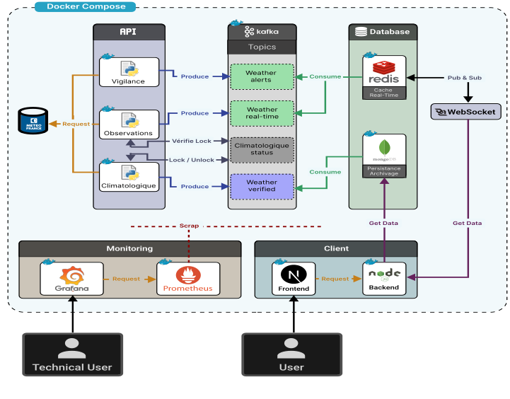

# 🌦️ Weather Data Platform

Plateforme de collecte, traitement, export et visualisation de données météorologiques, basée sur une architecture orientée microservices avec Kafka, FastAPI, Redis, MongoDB, Prometheus & Grafana.

---

## 📚 Sommaire

- [Installation rapide](#-installation-rapide)
- [Architecture du projet](#-architecture-du-projet)
- [Modules principaux](#-modules-principaux)
- [CI/CD GitHub Actions](#-cicd-github-actions)

---

##  Installation rapide

```bash
git clone https://github.com/AlexandreN8/Weather
cd weather

cp .env_template .env
docker-compose up --build

```

##  Architecture du projet

Voici l'architecture complète de notre application::



 Structure :
```
services/
├── api_climatologique_producer/
├── api_observations_producer/
├── api_vigilance_producer/
├── mongo_consumer/
├── redis_consumer/
├── api_export/
├── backend/
└── frontend/
```

---

##  Modules principaux

| Module                     | Description |
|----------------------------|-------------|
| `api_observations_producer` | Produit des données météo temps réel |
| `api_climatologique_producer` | Gère les données historiques (climatologie) |
| `api_vigilance_producer`   | Produit des alertes météo |
| `mongo_consumer`           | Stocke les données dans MongoDB |
| `redis_consumer`           | Publie les données en temps réel via Redis |
| `api_export`               | Permet d’exporter les données au format CSV |
| `backend`                  | API utilisateur, sécurisation, requêtes |
| `frontend`                 | Interface de visualisation |

---


---

##  CI/CD GitHub Actions

Chaque push sur la branche `main` déclenche :
- Vérification du code (lint + tests)
- Build des images Docker
- Push vers GitHub Container Registry (GHCR)
- Déploiement automatique sur une VM via SSH ( en cours..) 
